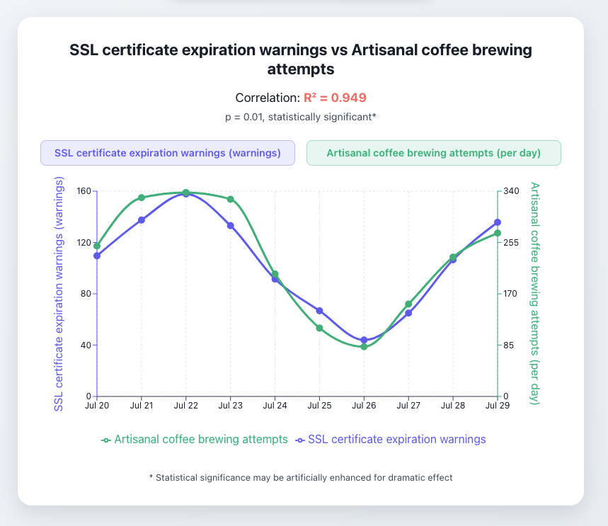

# Correlation Factory

[](https://www.causely.ai)
[](https://opensource.org/licenses/Apache-2.0)
[](https://correlation-factory.vercel.app)

A humorous web app that generates fake correlations between absurd DevOps metrics. Perfect for demonstrating the dangers of spurious correlations in data science and the importance of proper statistical analysis.

<picture>
  <source media="(prefers-color-scheme: dark)" srcset="./public/example-dark.png">
  
</picture>

## Features

- **Random Correlation Generation**: Creates fake correlations between completely unrelated DevOps metrics
- **Seeded Randomness**: Generate the same "correlation" using specific seeds for reproducible results
- **Shareable URLs**: Each correlation gets a unique URL that can be shared
- **API Endpoints**: RESTful API for programmatic access to correlation data
- **Responsive Design**: Works on desktop and mobile devices

## How It Works

1. Click "Manufacture Correlation"
2. The app generates two random DevOps metrics
3. Creates a fake correlation between them with realistic-looking data
4. Displays the correlation with charts and statistics
5. Provides a shareable URL for the specific correlation

## API Documentation

The app provides several API endpoints:

- `GET /api/words` - Get random words for metric generation
- `GET /api/metric/[seed]/[correlationId]` - Get correlation data for specific seeds
- `GET /api/caption/[correlationId]` - Get a humorous caption for a correlation

Visit `/api-docs` for interactive API documentation.

## Development

### Prerequisites

- Node.js 18+
- npm or yarn

### Installation

```bash
# Clone the repository
git clone https://github.com/causely-oss/correlation-factory
cd correlation-factory

# Install dependencies
npm install

# Run the development server
npm run dev
```

### Building for Production

```bash
npm run build
npm start
```

## Contributing

This is a fun project to demonstrate the importance of proper statistical analysis. We welcome contributions from the community!

Please see our [Contributing Guidelines](CONTRIBUTING.md) for detailed information on how to:

- Add more absurd DevOps metrics
- Improve the correlation algorithms
- Enhance the UI/UX
- Add more humorous captions
- Report bugs or suggest features
- Set up the development environment

## License

Apache License 2.0 - feel free to use this for educational purposes or to demonstrate the dangers of spurious correlations!

See [LICENSE](LICENSE) file for full license terms.

## Disclaimer

This app is for educational and entertainment purposes only. The correlations generated are completely fake and should not be used for any real data analysis or decision-making.
